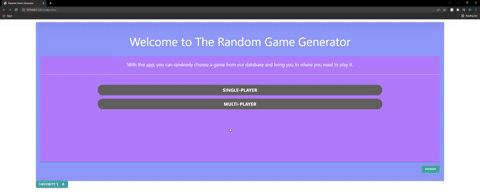

# random-game-generator

Welcome, with this app you are given the choise between Single or Muliti-Player video games.you will be promted with a selection of 8 games in either catagory. veiw information about said game under a picture of the game. this is possible because of are API we used (RAWG.io). It is a database ove over 500,000 games and is a very robust api with many features.

The following animation shows the web application's appearance and functionality:

When on chose of your button, you are responded with a selecton of titles in that given 
genre. 

You are give a selection of data (Relese date, rating, and genre).

and a location to find it on whatever marketplace it is avalible on.

In the future we plan on expanding the Information giving about the games, types of games you can choose (ie, shooters, RPG, V).

Add more games to the loop.

Giving you an option too look at your saved games.

LINKS
<link>(https://api.rawg.io/docs/)